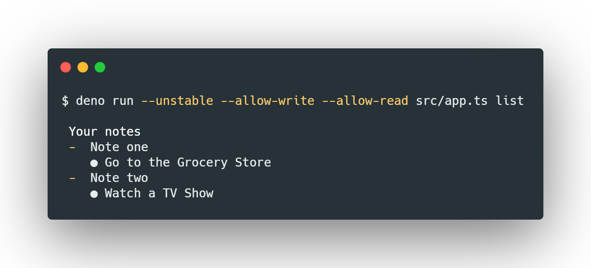

# Deno Notes Cli App

Create simple notes in json format from the command line usign Deno



## 🦕 About Deno

[Deno](https://deno.land/) is a secure runtime for JavaScript and TypeScript.

- It is written in Rust and TypeScript and built on top of V8 Engine.
- It is based on modern features of the JavaScript
- It has `TypeScript` at its core
- `Secure` by default. No file, network, or environment access, unless explicitly enabled.
- Ships only a single executable file.
- It embraces _ES modules_
- It has **no package manager** (at least not yet)

## 🚀 Quick start

### Installation

Shell (macOS, Linux)

```bash
$ curl -fsSL https://deno.land/x/install/install.sh | sh
```

Powershell (Windows)

```bash
$ iwr https://deno.land/x/install/install.ps1 -useb | iex
```

Homebrew (macOS)

```bash
$ brew install deno
```

Chocolatey (Windows)

```bash
$ choco install deno
```

### Usage

```bash
$ cd deno-notes-cli
$ deno run --unstable --allow-write --allow-read src/app.ts
```

## 🖥️ Avaliable Commands

| name   | example                                                                                                             |
| ------ | ------------------------------------------------------------------------------------------------------------------- |
| add    | deno run --unstable --allow-write --allow-read src/app.ts **add** "Note Three" "This is my new note"                |
| list   | deno run --unstable --allow-write --allow-read src/app.ts **list**                                                  |
| read   | deno run --unstable --allow-read src/app.ts **read** "Note One"                                                     |
| update | deno run --unstable -A src/app.ts **update** "Note Three" "Note Updated" "This is my new body"                     |
| remove | deno run --unstable --allow-write --allow-read src/app.ts **remove** "Note Three"                                  |

## 📝 License

This project is licensed under the terms of the [MIT](https://github.com/jeferson-sb/deno-notes-cli/blob/master/LICENSE) license

> Made with ♥ by Jeferson © 2020
